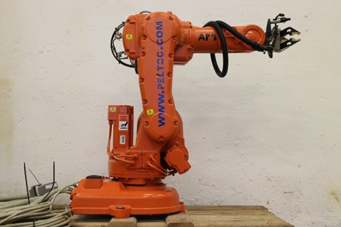
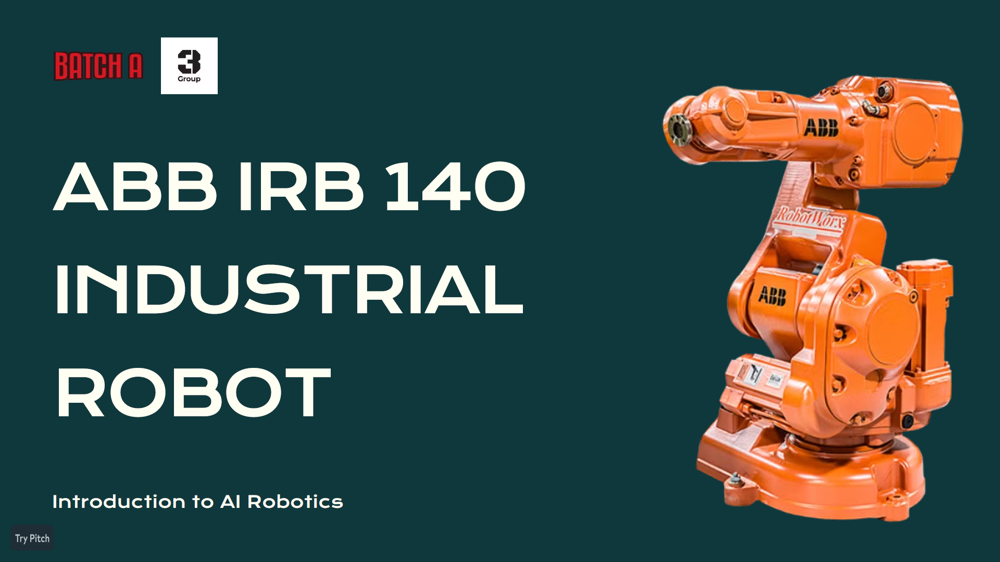

# IRB 140 Inverse Kinematics Solver and Simulation

This repository contains an artificial neural network (ANN) implementation for solving the inverse kinematics (IK) of the IRB 140 industrial robot. Two methods—direct and sequential—were tested for accuracy and efficiency, with the sequential method yielding better performance. The project also includes a detailed offline webpage built using Streamlit, which explains the robot's forward kinematics (FK), inverse kinematics (IK), and various other technical details. Additionally, the webpage offers an interactive 3D simulation, allowing users to adjust joint angles and view real-time results.

## Features

1. **Inverse Kinematics (IK) using ANN**:
   - Two methods tested: **Direct** and **Sequential**.
   - Comparison between the methods shows the **Sequential** method as more effective.

2. **Streamlit Webpage**:
   - Offline accessible page explaining the IRB 140 robot’s Forward Kinematics (FK) and Inverse Kinematics (IK).
   - Detailed explanations of the methods used and the architecture of the neural network.
   
3. **3D Simulation**:
   - Created in **Blender** and integrated into the webpage using **Node.js 3**.
   - **Interactive and rotatable** robot model with adjustable joint angles for real-time updates of the IK solution.
   
4. **Comparison**:
   - Comparative results between the direct and sequential methods, demonstrating the advantages of the sequential approach.

## How to Run:

1. Clone the repository:
   ```bash
   git clone https://github.com/Ganesh2609/RoboticsIK-ANN.git
   cd RoboticsIK-ANN
   ```

2. Run the offline Streamlit webpage:
   ```bash
   streamlit run 1_⚛️_Theory.py
   ```

4. Access the interactive simulation and technical explanations via your browser.

## Results

- Comparative performance of Direct and Sequential IK methods is included.
- **Interactive 3D simulation** allows users to adjust joint angles and view the corresponding IK solutions in real-time.

## Demonstraion
The offline webpage is as follows:
[](Media/sample_video.mp4)

For more details, refer to the Report.pdf file attached. It contains all the details about the implementation and the loss that we obtained for the Artificial Neural Network in each method. The presentation explaining that is also given below:
[](Report.pdf)