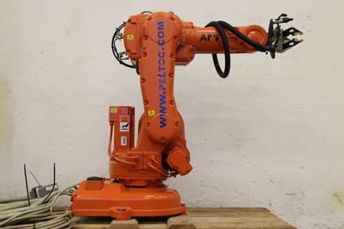
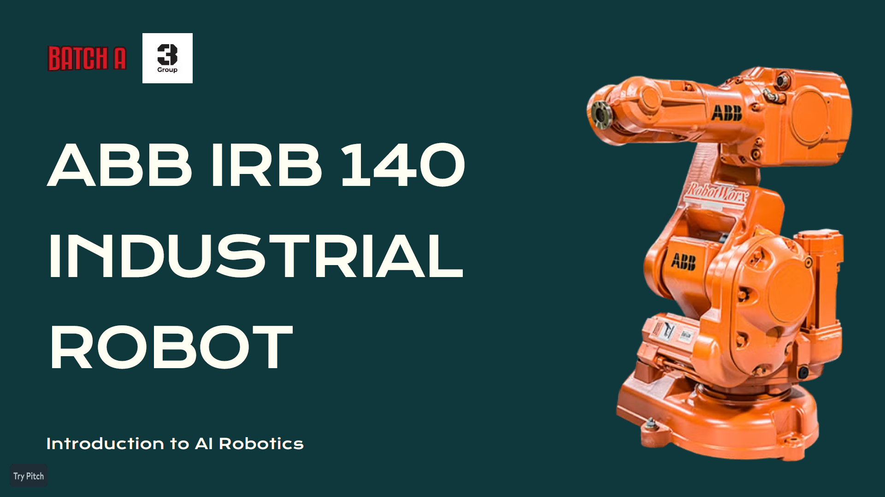

# ANN for Inverse Kinematics - IRB 140 Industrial Robot

[](Media/sample_video.mp4)

A comprehensive artificial neural network implementation for solving inverse kinematics of the ABB IRB 140 industrial robot, featuring both direct and sequential approaches with interactive 3D simulation.

## Project Overview

This project implements two distinct methodologies for solving the inverse kinematics problem of the IRB 140 industrial robot using artificial neural networks. The research compares a direct approach (predicting all 6 joint angles simultaneously) against a sequential approach (predicting each joint angle in sequence using previously calculated values).

### Key Results
- **Sequential Method**: MSE Loss = 0.0620, L1 Loss = 0.1975
- **Direct Method**: MSE Loss = 0.1127, L1 Loss = 0.2747
- Sequential approach achieved **45% improvement** in accuracy over direct method



## Technical Implementation

### Neural Network Architecture
The project uses a custom PyTorch model (`InverseKinematicsABBIRB140`) with the following architecture:
- **Input Layer**: 3 features (x, y, z coordinates) for direct method / Variable for sequential
- **Hidden Layers**: 4 layers with 128 neurons each
- **Activation**: ReLU with BatchNorm1d and Dropout regularization
- **Output**: 6 joint angles (direct) / 1 joint angle per model (sequential)

### Dataset
- **Training Data**: 10 million synthetic data points generated using forward kinematics
- **Validation**: 1 million additional data points for testing
- **Preprocessing**: MinMax scaling applied to normalize joint angles and coordinates

### Sequential Methodology
The sequential approach trains 6 separate models:
1. **Model 0**: Predicts joint_0 from (x, y, z)
2. **Model 1**: Predicts joint_1 from (x, y, z, joint_0)
3. **Model 2**: Predicts joint_2 from (x, y, z, joint_0, joint_1)
4. **Models 3-5**: Continue the pattern for remaining joints

## Interactive Features

### Streamlit Web Application
The project includes a comprehensive offline webpage built with Streamlit featuring:
- **Theoretical Background**: Complete explanation of forward and inverse kinematics
- **Technical Documentation**: DH parameters, transformation matrices
- **Interactive Q&A**: Common robotics questions and programming examples
- **3D Simulation**: Real-time robot visualization

### 3D Robot Simulation
- Created in **Blender** and integrated using **Three.js**
- Interactive joint angle adjustment with real-time IK solution updates
- Rotatable 3D model for comprehensive visualization
- Direct integration with trained neural network models

## Code Structure

### Training Scripts
- `01_entire_model.ipynb`: Direct approach implementation
- `02_sequential_ann_train.ipynb`: Sequential approach training
- `03_testing_entire.ipynb`: Direct method validation
- `04_testing_sequential.ipynb`: Sequential method validation
- `05_generate_joint_angles.ipynb`: Joint angle generation for new coordinates

### Web Application
- `1_⚛️_Theory.py`: Main theory page with robotics fundamentals
- `2_🔧_Robotics_toolbox.py`: Robotics toolbox documentation
- `3_👨‍💻_Simulation.py`: Interactive 3D simulation interface
- `4_❓_Q_and_A.py`: Questions and answers section
- `5_🤝_Contributors.py`: Project contributors
- `6_📑_References.py`: Reference materials

## Installation and Usage

### Prerequisites
```bash
pip install torch torchvision pandas numpy scikit-learn matplotlib streamlit pillow tqdm
```

### Running the Application
1. Clone the repository:
```bash
git clone https://github.com/Ganesh2609/RoboticsIK-ANN.git
cd RoboticsIK-ANN
```

2. Launch the Streamlit application:
```bash
streamlit run "Offline Webpage/1_⚛️_Theory.py"
```

3. Access the interactive simulation and documentation through your web browser

### Training New Models
Execute the Jupyter notebooks in sequence:
1. Generate training data using forward kinematics
2. Train models using either direct or sequential approach
3. Validate performance using test datasets
4. Generate joint angles for new coordinate inputs

## Performance Analysis

### Computational Efficiency
- **Sequential Training Time**: Distributed across 6 smaller models
- **Direct Training Time**: Single large model with higher complexity
- **Inference Speed**: Sequential method shows competitive real-time performance

### Accuracy Metrics
| Method | MSE Loss | L1 Loss | Improvement |
|--------|----------|---------|-------------|
| Direct | 0.1127 | 0.2747 | Baseline |
| Sequential | 0.0620 | 0.1975 | 45% better |

## Technical Innovations

### Sequential Learning Architecture
- Each subsequent model leverages information from previously calculated joint angles
- Reduces complexity of individual learning tasks
- Mimics natural inverse kinematics solving process

### Interactive Visualization
- Real-time neural network inference integrated with 3D graphics
- Educational tool for understanding robot kinematics
- Practical demonstration of machine learning in robotics

## Applications and Use Cases

### Industrial Robotics
- Path planning for manufacturing applications
- Real-time motion control systems
- Collision avoidance in complex environments

### Educational Applications
- Interactive learning tool for robotics students
- Demonstration of machine learning in engineering
- Visualization of complex mathematical concepts

### Research Applications
- Benchmark for inverse kinematics algorithms
- Platform for testing new neural network architectures
- Foundation for more complex robotic systems

## Future Enhancements

### Technical Improvements
- Integration with reinforcement learning for dynamic environments
- Real robot hardware integration and validation
- Support for additional robot models and configurations

### User Experience
- Mobile-responsive web interface
- Cloud deployment for broader accessibility
- Advanced visualization features and animations

## References

1. Robotics Toolbox for Python: [Peter Corke's Robotics Toolbox](https://petercorke.github.io/robotics-toolbox-python/)
2. Sequential Machine Learning Methodology: [MDPI Applied Sciences](https://www.mdpi.com/2076-3417/12/19/9417)
3. ABB IRB 140 Technical Documentation
4. PyTorch Deep Learning Framework
5. Three.js 3D Graphics Library
